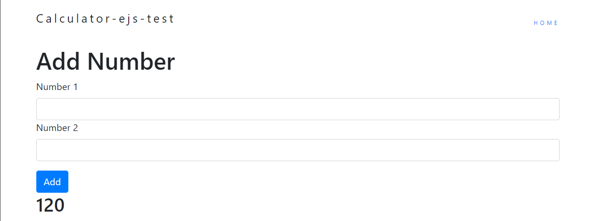

# calculator-ejs-test

> Basic calculator made with EJS to help out a student in Udemy understand folder structure and how to retrieve user input.
___
### Table of Contents

- [Description](#description)
- [Usage](#usage)
- [Credits](#credits)
___
## Description
A student on the 2020 Full-stack Web Development Bootcamp had trouble rendering their app. So I decided to create one from scratch and show him where he was going wrong in his code.

#### Technologies Used:
- HTML
- CSS
- EJS
- Body Parser
- NPM
- Express
- Bootstrap
- <a href="https://atom.io/">Atom</a>

___

## Usage
This project has no usage other than to present future employers of my progress as a Fullstack Web Developer.
___

## Credits
- Harold F.
